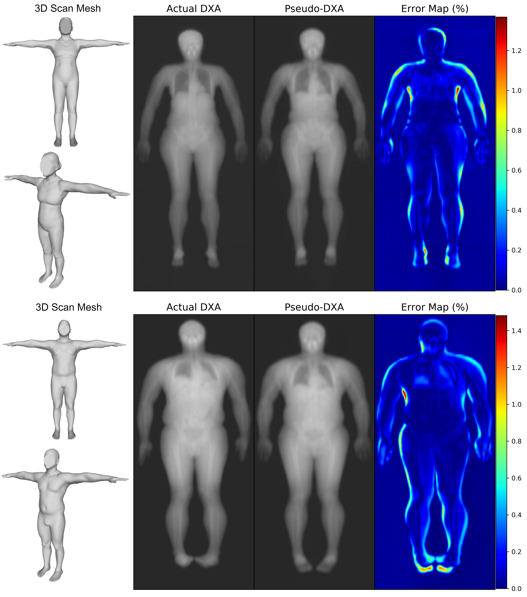
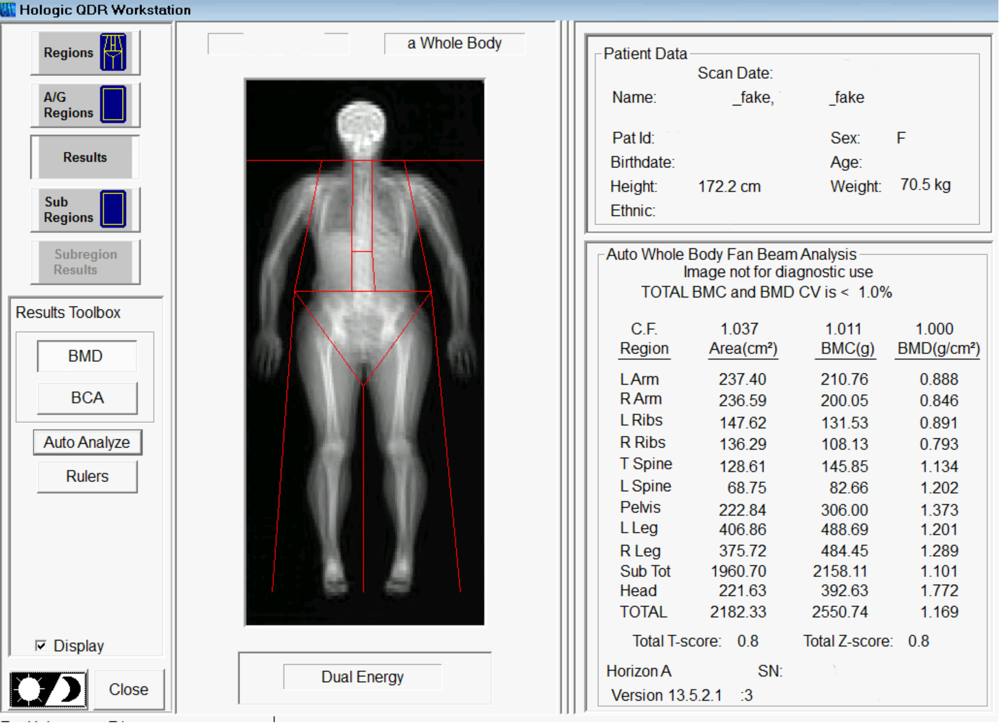
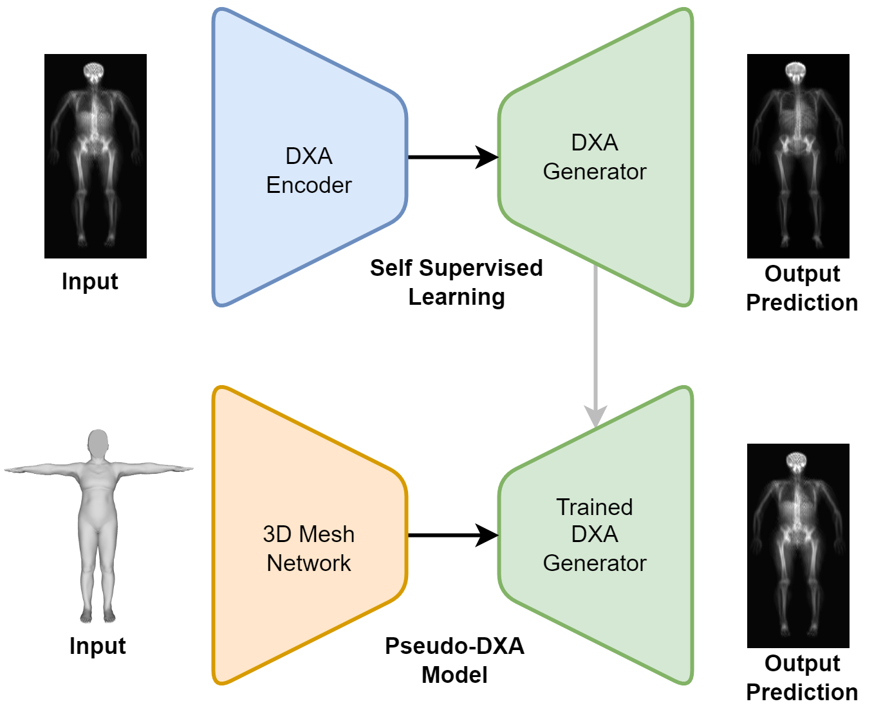

# Pseudo-DXA

Pseudo-DXA is a generative deep learning model which produces qualitatively and quantitatively dual energy X-ray absorptiometry (DXA) scans from three-dimensional (3D) body surface scans. This is the first medical imaging model to demonstrate quantitative accuracy on commercial clinical software (Hologic inc's Apex version 5.5) yielding accurate measures of fat mass, lean mass, and bone. 

This model was developed by [Lambert T Leong](https://github.com/LambertLeong),[PhD](https://www.lambertleong.com/) advised by [John A Shepherd](https://github.com/shepherd-lab) as a part of the [Shepherd Research Lab (SRL)](https://shepherdresearchlab.org/) and the [University of Hawaii Cancer Center](https://www.uhcancercenter.org/component/finder/search?q=lambert+leong&Itemid=926)



## Setup
Pseudo-Dxa runs on linux and require a GPU.

Install dependencies:  
* Python >= 3.6
* tensorflow >= 2.4
* plyfile >= 0.7.4
* opencv-python >= 4.5.2
* numpy >= 1.19.5

## 3D Mesh Preprocessing:

All 3D Scan Meshes must be fitted and standardized to a T-pose with 110K points using the [Meshcapade API](https://meshcapade.com/docs/api).

## Usage
Update the config file:
* GPU device id. Variable = [setup][gpu]
* Path to model weights. Variable = [model][lleong_psdxa_weights]
* Path to ply file or 3D mesh. Variable = [predict][mesh_path]
* Path to output dir. Variable = [predict][out_path]

### Trained Weights and Fitted Mesh Test File.
Weights for a version of a working Pseudo-DXA model and a fitted mesh for testing will be made available upon request to the [SRL Website](https://shepherdresearchlab.org/data-software/)  

### Running
```
python predict.py -c model.config
```
Expected outputs: Raw DXA as a 6 channel npy file, raw DXA single channel PNG, and a processed DXA single channel PNG.

### Quantitative Body Composition Analysis
Code for transforming NPY files into proprietary DXA files for analysis cannot be made publicly available. Those at [SRL](https://shepherdresearchlab.org/data-software/) can perform the transformation and should be contacted accordingly. Resulting DXA file can then be analyzed using DXA body composition analysis software as shown below.



## Acknowledgments
The base model was trained using self-supervised learning on over 20K DXA scans from the [Bone Mineral Density in Childhood Study](https://www.nichd.nih.gov/research/supported/bmdcs) and [The Health, Aging and Body Composition Study](https://healthabc.nia.nih.gov/). Training of the final model was on patients from the [Shape Up! Studies](https://shapeup.shepherdresearchlab.org/) who received pairs of DXAs and 3D scans on the same day. The training schema is shown below.



## Contact
For questions or more information: [lambert3+psdxa@hawaii.edu](lambert3+psdxa@hawaii.edu)
